##
# Amazing Superstore Analysis

  
## Introduction

**Type of Data Set:**  Sales Dataset 

**Stakeholder Requirement / Problem Statement:** The analysis aims to identify areas where the company can improve its performance and productivity, also draw out insight for Improved Decision-Making, Sales and Profitability. 
1. Create a dashboard, do a Show and Tell at the end of the Sprint
2. Create a power point presentation to present the insight and recommendation.
3. Document the insights

**Data Structure:** There are 2 tables in the dataset, which are named <kbd> Listoforders </kbd> and <kbd> Orderbreakdown </kbd>.

**Relationship between the Stakeholder Requirement and the Dataset:** There is a strong relationship between the stakeholder requirement and the dataset considering column like Discount, sales, Profit and category. The dataset is super rich and it’s capable of providing relevant insights.
  
## Analysis Pipe Line

**Data Source:** SharePoint

**Data Transformation/Cleaning:** Data cleaning and transformation was carried out using Power Query. After scrutinizing all the columns, they were found to be valid and devoid of empty cells and errors. However, it was highly important that I transformed the Discount column to percentage for calculation purposes.

Hence new column and Tables were created, which are listed below
- A calendar table was created, this was achieved by using the <kbd> Min </kbd> and <kbd> Max </kbd> dax function on the <kbd> order date</kbd> from the <kbd>Orderbreakdown Table</kbd>.
- The <kbd>Month and Year columns </kbd> were also created on the <kbd>calendar table </kbd> which were extract of the <kbd>date column </kbd> on the <kbd>calendar table</kbd>.
- A new column was created for <kbd>Cost of Sale</kbd> on the <kbd>Orderbreakdown Table</kbd> by using the formula below
  
   Cost of Sales = Orderbreakdown[Sales] - Orderbreakdown[Profit]

   The formula above is simply “Cost of sales = Sales – profit”

   How the formula is derived is explained below
  
   Sales = Revenue

   Cost of Sales = Selling Price

   Profit = Revenue – Selling price

   **∴ Selling Price = Revenue - Profit**

- Another column was created named <kbd>SP_before_Dis</kbd> which stand for Selling Price Before Discount

   - The formula below is used if the <kbd>discount column</kbd> is in decimals
     
     SP_before_Dis = ( 1 * Orderbreakdown[Sales] ) / ( 1 - Orderbreakdown[Discount] )

   - This formula below is used if the <kbd>discount column</kbd> is in percentage 

     SP_before_Dis = (100 * Orderbreakdown[Sales] ) / ( 100 - Orderbreakdown[Discount] )
       
   The above financial formula shows the original selling price before discount is applied, let me break it down to show how we arrived at the above.
     
     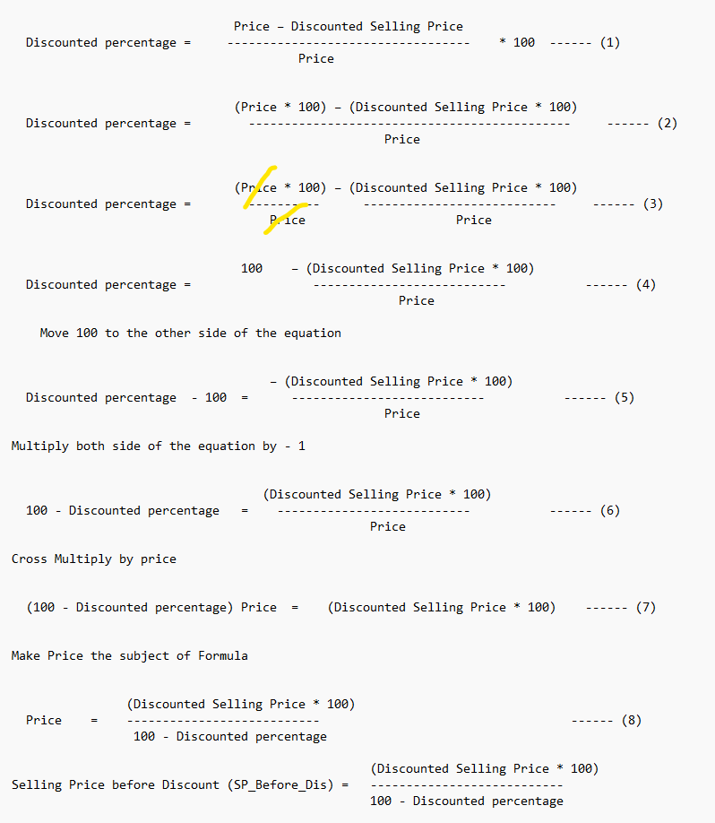

- A column was created for **profit without discount** (<kbd>Profit_B4_Dis </kbd>), this column shows the profitability of the company without applying any discount on sales.

      Cost of sale is Unique and Universal
  
      Profit = Revenue - Selling Price without Discount
  
      Revenue is also knows as sales
  
      Selling Price is also known as cost of sales.
  
      The Formula used is shown below
  
      <kbd> Profit_B4_Dis = Orderbreakdown[SP_before_Dis] - Orderbreakdown[Cost of Sales] </kbd>

 - A column named <kbd>Yes&No</kbd> was created, which state If Discount = 0 return No and If Discount > 0 is to return Yes
 - A Measure Table was created to house the Dax Functions

   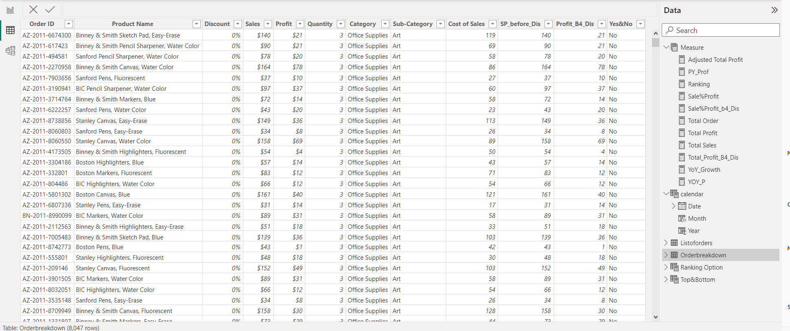
     
## Data Modelling 

The data provided for this analysis are located on two tables and new a new Calendar table was also created. 
Therefore, an appropriate modelling is required. A Snowflake model is designed with the <kbd>Orderbreakdown Table</kbd> representing the Fact table containing all the day to day activities of the business, the dimension tables are the <kbd>Listoforders Table</kbd> and <kbd>Calendar Table</kbd>

You must understand the snowflake model which will enable you know how to carry out your filters and direction of filter.

   - 	For <kbd>Orderbreakdown Table</kbd> and <kbd>Listoforders Table</kbd> is <kbd>Order ID</kbd>
   - 	For <kbd>Listoforders Table</kbd>  and <kbd>Calendar Table</kbd> is <kbd>Order Date</kbd> and <kbd>Date</kbd> Respectively.
  
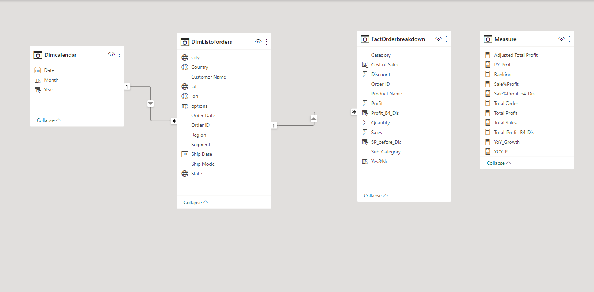
  
## Analysis

Complex Dax functions were employed to solve business problem.

   1. Year on Year Growth is abbreviated as <kbd>YoY_Growth</kbd>
   
      <kbd>YoY_Growth</kbd> = (Current year Profit – Previous Year Profit) divide by Previous Year Profit
      
      The Dax function used to achieve this data manipulation was the <kbd>Divide function</kbd>
      
       <kbd>YoY_Growth</kbd> = <kbd>DIVIDE</kbd> ( (<kbd>[Total Profit] </kbd> - <kbd> [PY_Prof] </kbd>), <kbd> [PY_Prof]</kbd> )
      
  2. **Previous Year profit** was calculated by using **complex Dax function**. A complex dax function is the combination of more than one dax function.
     
     Previous year profit was manipulated using a <kbd>calculate function</kbd>, <kbd>sum function</kbd> and <kbd>dateadd function</kbd> were used as shown below

     <kbd>PY_Prof = CALCULATE([Total Profit], DATEADD('Dimcalendar'[Date],"-1",YEAR))</kbd>

     <kbd>Calculate function</kbd> is a **filter function**, the sum of **Total Profit** is filter by <kbd>date add function</kbd>.

  
## Visualization, Trends, Patterns & Insight.  

 For Live Visualization click here <kbd>[Live-Visualization](https://app.powerbi.com/view?r=eyJrIjoiMzczYjA0YzItYTgzZi00MTk0LTk4ZTYtN2U4MDdjYzk2ZjQ3IiwidCI6IjU0OGU5MDRlLTY2MDEtNGQ0My1iZmY3LTYzZGRlZTRjOWVlNiJ9&pageName=ReportSectiona0423d4498c17d5c245d)</kbd>
  
**Home Page**

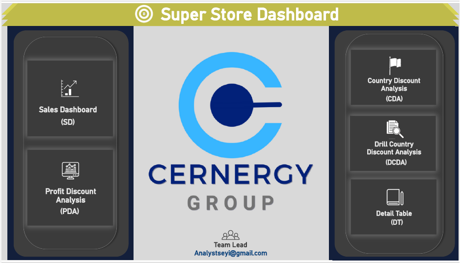

The visual above is an Home page which made it easy for navigating between different pages of this report.
The following pages below can be interacted with on the Home Page.

   1. Sales Dashboard (SD) : This shows the day to day operation of the Company
   2. Profit Discount Analysis (PDA) : Relationship between Profit and Discount
   3. Country Discount Analysis (CDA) : Analysis of Countries by Discount
   4. Drill Country Discount Analysis (DCDA) : Drill down country Performance
   5. Detail Table (DT)
  
**Home Page**

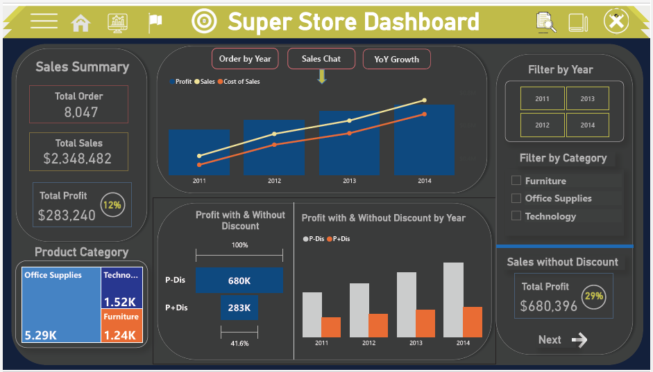

According to the data the following visual were derived.

   1. The **Total Profit** for the entire given period between **2011 to 2014** is **$283,240** which is **12%** of the **Total Sale "$2,348,482"** which is less than the **Industry Average**. Despite the company is making profit but the company profitability is lesser than the industry average.
   2. At this point, the data was further observed and amazing insight were uncovered
 

**Total Order by Year**

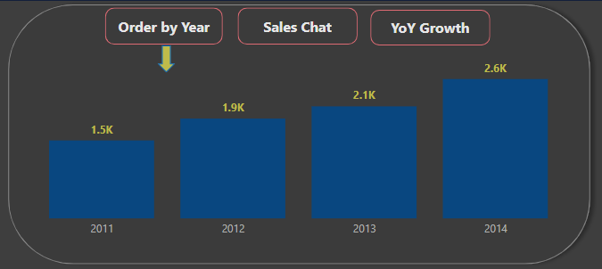

The visual above was done with the use of bookmarking, which means that we have 3 different visual in one. This can be switched from one visual to another i.e From **Order by Year** to **Sales Chat** and **Year on Year Growth**. 

**Analyzing the visual above**

The chat shows that number of order have increased over the years.
From **1462 orders** in the year **2011** to **1871 orders** in **2012**, **2101 order** in **2013** and **2613 order** in **2014**.  
Basic economic theories states that increase in number of orders is directly proportional to profit.
 
  

**Sales Chat**

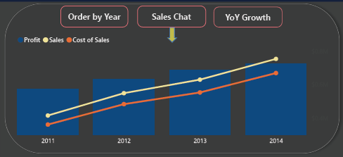
    
The visual above shows the 3 important metrics on the dataset, which are **Sales**, **Cost of Sale** and **Profit**. They have been on a constant upward linear trend.  These good metrics are as a result of the periodic increase in the number of orders over the years.   If all the metrics are good, why is the company profit (12%) below the industry average?
This led me to calculating the year to year profitability of the company 
 
  

**Year on Year Profit Growth**

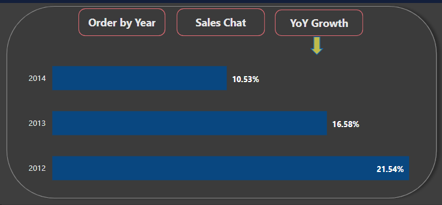

It’s itersting to find out that despite the good metrics and increase in profit over the year, the year to year profitability growth of the company has been on a constant downward trend. Which is **21.57%** in **2012** down to **16.58%** in **2013** and **10.53%** in **2014** and this is over **50%** decline in profit growth over the last 3 years.
It’s an eye opener, the dataset further probe to find out what is responsible for the downward trend in profit growth.
The impact of discount on the overall profitability was analyzed

  

**Sales without Discount**

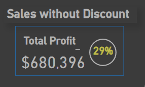

**Total Profit without Discount** (Meaning no discount was applied on sales) is **$680,396** which is **29%** of the total sales **$2,348,482**. This is greater than the industry Average.

**All The metrics shown above are not peculiar to a particular year or category but Universal**. 

  

**Impact of Discount on Profit**

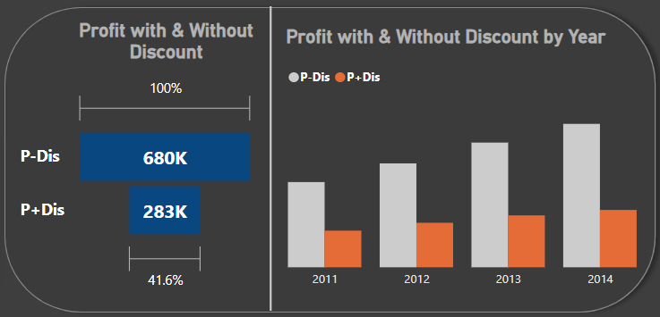

The total profit made by the company is **$283k** which is **41%** of what the company would have made if they have no discounted product **"$680k"**
In the entire period the dataset covers, there was ***no time*** that **Profit with Discount** did **50%** of **Profit without discount**.
This shows that discount have a serious impact on the company profitability and performance.

  

**Profit by Discount**

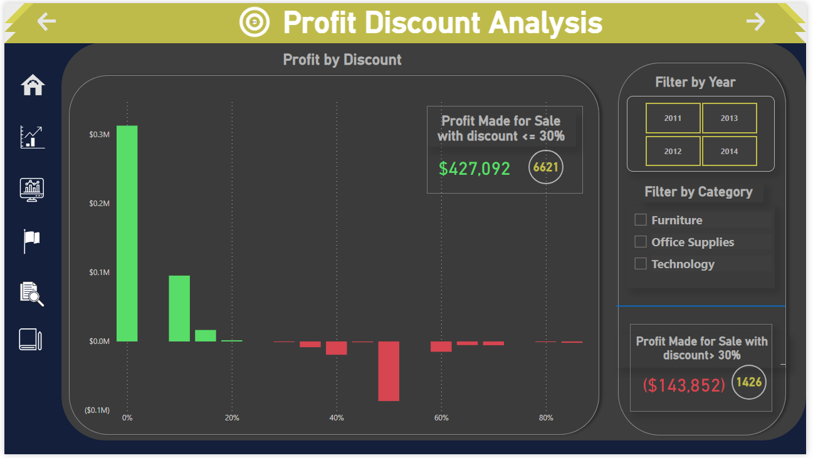

It's now obvious that discount have serious impact on profit, we need to check how deep it cut through.
It was discovered that the company had only made profit with discount **<= 30%** which is **$427,092** with **6621 orders**. The company made huge lose on discount **> 30%** which is to the sum of **-$143,852** with **1426 Order**.
Which means that the company would have made more profit for selling only product with **<= 30% discount** than the company **Overall Total Profit**, because selling product which are **> 30% discount** resulted into loses and reduced the company profitability.  This is applicable to all the years and category frame. 

  

**Analyzing Country by Discount**

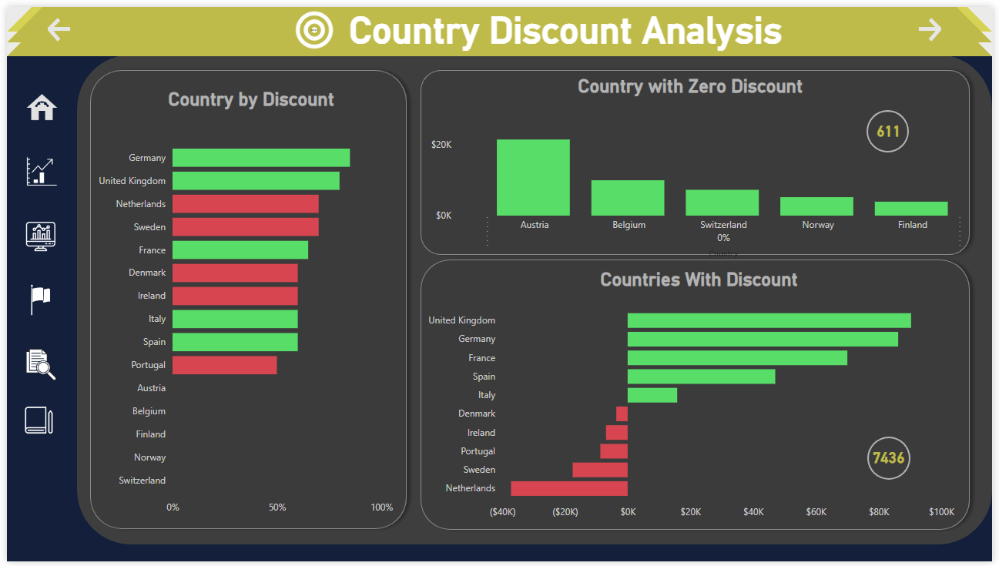

**5 countries** named **Austria**, **Belgium**, **Switzerland**, **Norway** and **Finland** did not offer discount and they made a cumulative profit of **$47,553** with a total number of **611 order** but which is only **52.6%** of the **Total Profit** made by **United Kingdom ** which is **$90,382** with **1314 orders** 

The country with **zero discounts** have **minimal number of orders**, as it was previously stated that **total number of order is directly proportional to profitability**.
 

Despite Discount Offered in different Country, the **5 top performing countries** are **United Kingdom $90,382 (1314 Orders)**, **Germany $86,279 (1640)**, **France $70,067 (1916 Orders)**, **Spain $47,067 (761 Orders)** and **Italy $15,802 (979 Orders)**.  

The **5 least performing countries** are **Netherland ($37,188) 393 Order**, **Sweden ($17,524) 203 Orders**, **Portugal ($8,704) 70 Orders**, **Ireland ($6,886) 100 Orders** and **Denmark ($3,608) 60 Orders**.

One thing that is peculiar to least performing countries is that they have most of their orders in the **discount bracket of > 30%**. While the performing country orders are mostly in **<= 30% discount bracket**. 

 

**Netherland**            |          
:----------------------------: 
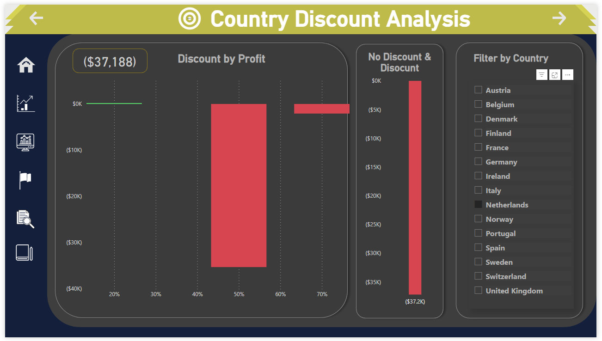           |      
 

**Sweden** |
|:--------------------------:
|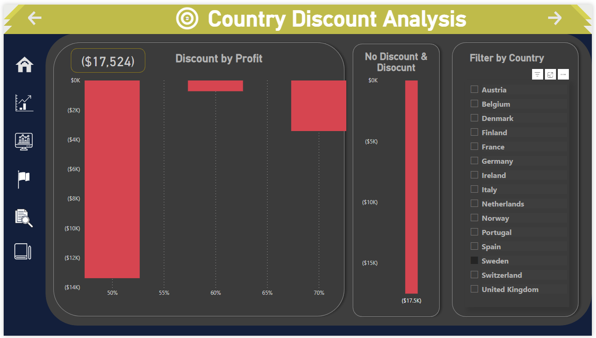
 

**Portugal** |
|:--------------------------:
|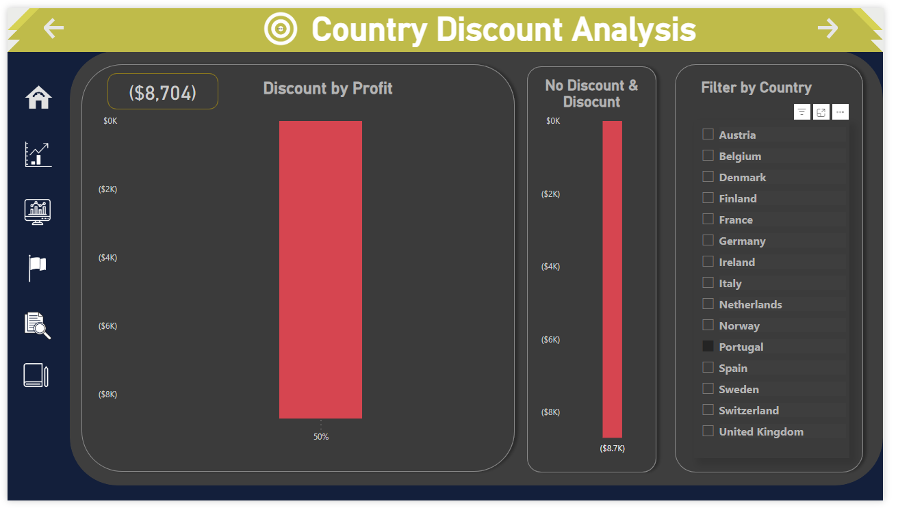
 

**While the performing countries have majority of these orders below the 30% discount Bracket**.

 

**United Kingdom**            |          
:----------------------------: 
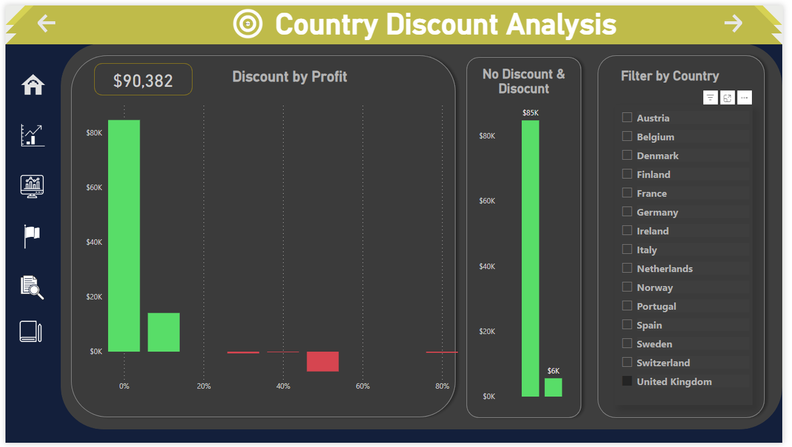           |      
 

**Germany** |
|:--------------------------:
|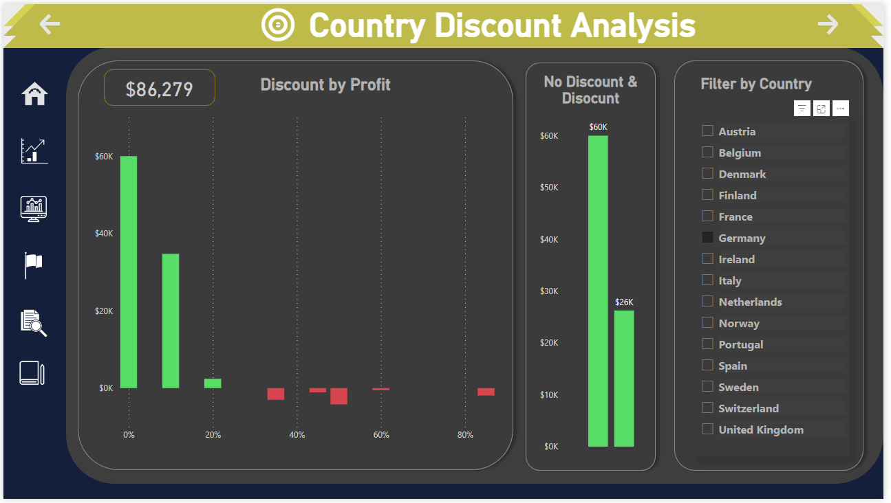
 

**France** |
|:--------------------------:
|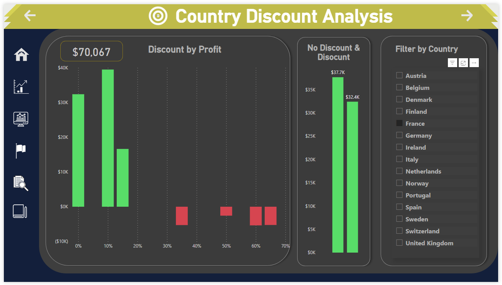
 

**Tooltip** is activated on this visual to know the specific number of order, You can check this out on the live visual.

 For Live Visualiztion click here <kbd>[Live-Visualization](https://app.powerbi.com/view?r=eyJrIjoiMzczYjA0YzItYTgzZi00MTk0LTk4ZTYtN2U4MDdjYzk2ZjQ3IiwidCI6IjU0OGU5MDRlLTY2MDEtNGQ0My1iZmY3LTYzZGRlZTRjOWVlNiJ9 )</kbd>
 

  
## Conclusion and Recommendations.  

1. The company should look into the pattern of allocating discount to orders, the data shows that **discount >= 30%** is not healthy for it performance and profitability.
2. Increase in **number of orders** is directly proportional to **profitability**, if **discount is < 30%**. This means that the company should work on increasing the number of orders received, so as to increase profit in countries with 0% discount. While work on it discount structure in every other countries to increase it profitability, particularly in countries with negative balance sheet.
More capacity and efficiency should be drive towards increase in total net order.
3. Further Research and Analysis should be carried out on why the company gives discount, how they give disount and the measure in giving discount. According to the data provided it was evidence that some discount lead to loses and upto 80% discount was applied to some cases.
 

**The goal is to provide value to the stakeholders and not just to build reports and dashboard**.
 
 
## Skills / concepts demonstrated.  

The following Power BI features were incorporated:
-	Bookmarking,
-	DAX,
-	Quick measures,
-	Page navigation,
-	Modelling,
-	Filters,
-	tooltips,
-	Button

## Tools Used. 

- Microsoft Sharepoint
- Microsoft Power BI Desktop
- Power Query Editor
- Microsoft Power Point
  
#
## Thank you.
